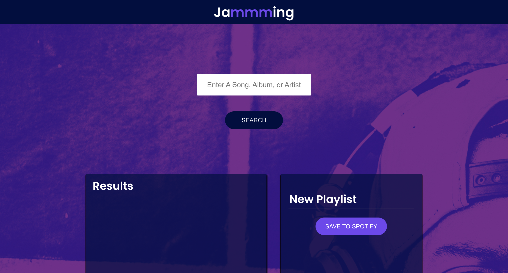

# Jammming app

### Overview
Utilising React and the Spotify API to build an app that allows users to search the Spotify library, create a custom playlist, then save it to their Spotify account. Completed as part of the [Codeacademy Full-Stack Engineer pathway] (https://www.codecademy.com/learn/paths/full-stack-engineer-career-path).

### Learning Objectives
Improve knowledge of APIs and asynchronous requests.

